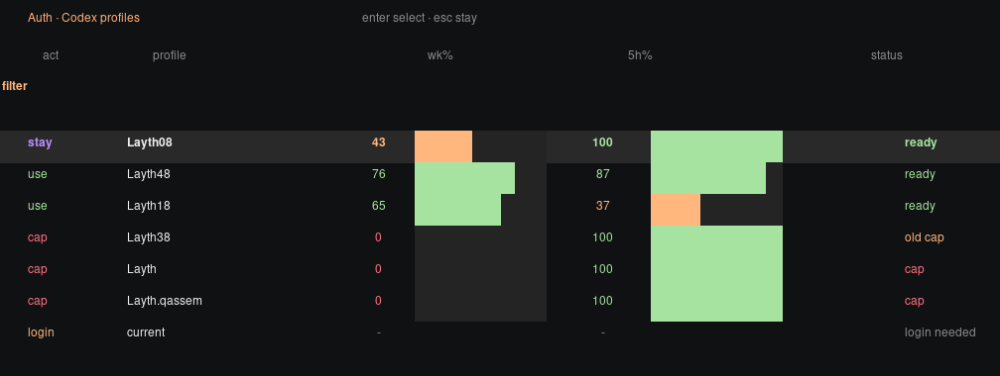
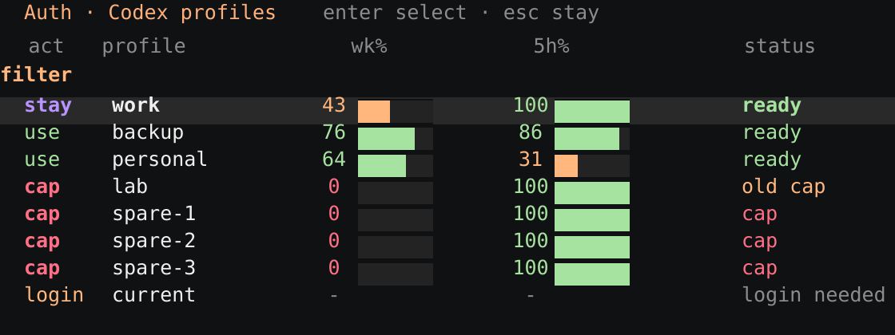

# Codex Rolling Auth

Small shell wrapper for running Codex with rotating saved ChatGPT auth profiles.

It keeps `auth.json` pointed at the best available profile before a session starts, keeps checking while the TUI is open, and if Codex exits with a usage-limit or rate-limit message it switches auth and resumes the latest session.





## Install

```bash
git clone https://github.com/editnori/codex-rolling-auth.git
cd codex-rolling-auth
./install.sh --wrap-codex
```

That installs:

- `codex-auth`, the profile manager and rolling runner
- `codex`, an optional shim that sends normal Codex sessions through `codex-auth run`

If you only want the manager and not the `codex` shim:

```bash
./install.sh
```

## Usage

Save the current login as a profile:

```bash
codex-auth add Layth08 --current
```

Open the usage selector:

```bash
codex-auth usage --refresh --select
```

Run a rolling Codex session explicitly:

```bash
codex-auth run -- resume --last
```

Resume a specific session with rolling auth:

```bash
codex-auth run -- resume 019e1af9-d95b-7f11-b1f0-aae08a7c4f1d
```

If you installed the shim with `--wrap-codex`, normal Codex commands also roll:

```bash
codex resume 019e1af9-d95b-7f11-b1f0-aae08a7c4f1d
```

## Notes

- Profiles live under `$CODEX_HOME/auth-profiles` by default.
- The live auth file stays at `$CODEX_HOME/auth.json`.
- Set `CODEX_AUTH_CODEX_BIN=/path/to/codex` if the wrapper cannot find your real Codex binary.
- Set `CODEX_AUTH_AUTO=0` to bypass automatic rolling for one command.
- Set `CODEX_AUTH_USAGE_HEADER=1` or `CODEX_AUTH_USAGE_STATUS=1` if you want the full table header or status column back.
- Set `CODEX_AUTH_SELECTOR_CENTER=1` if you want the selector vertically centered in the terminal.

## Regenerate Assets

```bash
node scripts/generate-assets.mjs
```
