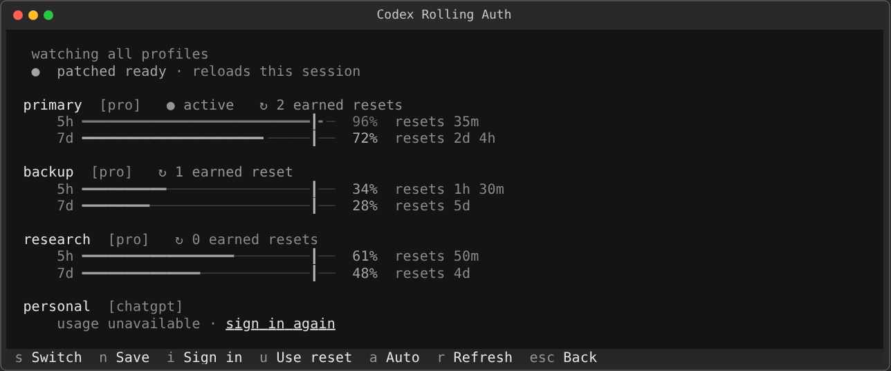
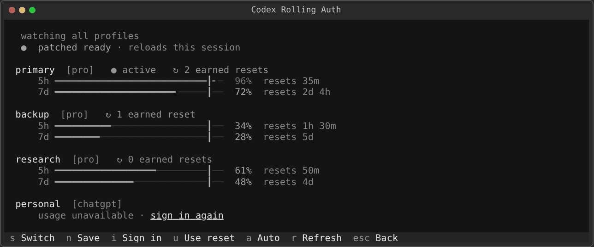
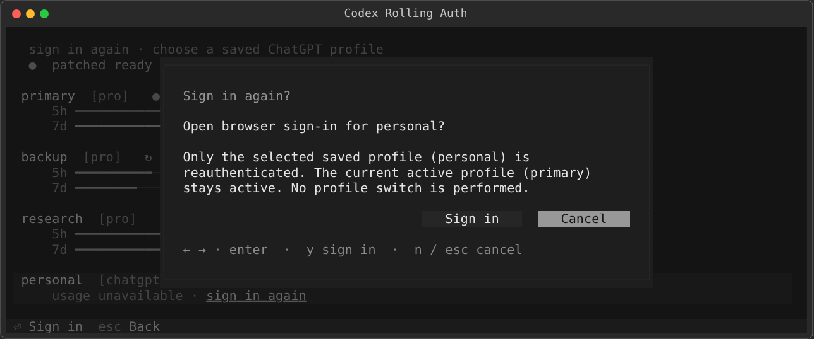
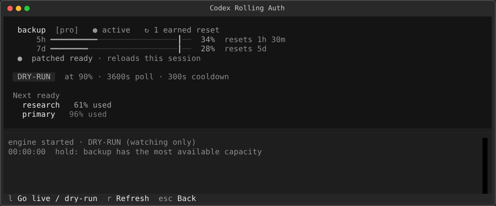
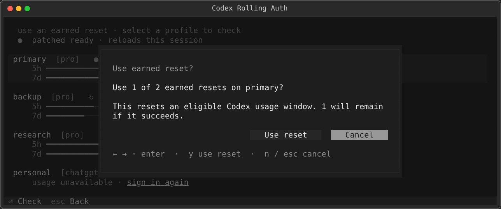

# Codex Rolling Auth

Small shell wrapper for switching Codex to the best saved ChatGPT auth profile before or during a session.

It keeps `auth.json` pointed at the best available profile before a session starts. The optional `codex` shim only does a cached auth selection and then execs the real Codex binary, so normal Codex launches do not create nested runners, live log monitors, or extra MCP/app-server sidecars.

[](https://github.com/editnori/codex-rolling-auth/actions/workflows/ci.yml)



_Synthetic demo data. No live credentials or account identifiers._

<details>
<summary>Watch the keyboard flow</summary>



</details>

### Sign in again without switching profiles



| Dry-run autoswitch | Earned reset confirmation |
| --- | --- |
|  |  |

All captures use the real Textual app with an in-memory synthetic backend.

## Requirements

- Linux or WSL with Bash, `jq`, `flock`, Git, and the official Codex CLI.
  `claude-gpt` specifically requires Bash 5.1 or newer for supervised child waiting.
- [`uv`](https://docs.astral.sh/uv/) for the isolated Textual environment.
- `crontab` is optional; without it, run `codex-auth maintain` after a direct curl update.
- Building the patched Codex generation also needs a Rust/Cargo toolchain and normal native build dependencies.
- Running GPT inside Claude Code also needs Claude Code. The installer supplies
  the pinned [`claude-code-proxy` compatibility build](https://github.com/editnori/claude-code-proxy/releases/tag/v0.1.10-codex-auth.2).

## Install

If Codex came from the official curl installer, install or update Codex first. That installer owns the visible `~/.local/bin/codex` link. `./install.sh --wrap-codex` installs a one-minute maintenance job that restores the rolling-auth shim after a later curl update and queues the matching patch build.

```bash
curl -fsSL https://chatgpt.com/codex/install.sh | sh
```

```bash
git clone https://github.com/editnori/codex-rolling-auth.git
cd codex-rolling-auth
./install.sh --wrap-codex
```

The wrapper resolves the native binary through `$CODEX_HOME/packages/standalone/current/bin/codex` (and the legacy `current/codex` layout), so it follows the curl installer's current release instead of falling back to an older Bun/npm copy.

That installs:

- `codex-auth`, the profile manager and rolling runner
- `codex-auth-tui`, the full-screen watcher in a private project `.venv`
- `claude-gpt`, an opt-in Claude Code launcher backed by a saved ChatGPT/Codex subscription profile
- `codex`, an optional shim that runs `codex-auth auto --quiet --no-background` and then starts the real Codex binary
- patched-Codex selection: when a matching generation exists, the shim uses it with in-process rolling auth enabled; when Codex updates, the shim immediately runs stock Codex and starts one detached patch build
- a marked, idempotent cron entry that runs `codex-auth maintain --quiet` once per minute without replacing existing cron jobs

The installer uses `uv` with the platform's native TLS store to create the TUI environment under `PREFIX/lib/codex-auth/tui/.venv`. It does not install Python packages globally. Packaging and isolated tests can copy the project without resolving dependencies by setting `CODEX_AUTH_TUI_SKIP_BOOTSTRAP=1`; normal installs should leave bootstrap enabled.

If you only want the manager and not the `codex` shim:

```bash
./install.sh
```

`claude-code-proxy` is a separate MIT-licensed third-party dependency.
`install.sh` downloads the pinned `0.1.10-codex-auth.2` compatibility build,
verifies its published SHA-256 checksum, and installs it beside `claude-gpt`.
That build stays source-visible in the
[`editnori/claude-code-proxy` fork](https://github.com/editnori/claude-code-proxy)
and contains two focused fixes submitted upstream: true Sol `max` effort
([PR #28](https://github.com/raine/claude-code-proxy/pull/28)) and terminal
context-window responses that activate Claude compaction
([PR #29](https://github.com/raine/claude-code-proxy/pull/29)), plus immediate
rate-limit classification and isolated-auth reloads
([PR #30](https://github.com/raine/claude-code-proxy/pull/30)). The launcher
prefers the sibling binary and refuses a different version by default. Set
`CODEX_AUTH_INSTALL_CLAUDE_GPT_PROXY=0` only if you do not want GPT-in-Claude
support or will install the exact proxy version yourself.

## Usage

### Run GPT in the Claude Code harness

Start normal Claude Code with the currently active saved Codex profile:

```bash
claude-gpt
```

Pin a different saved profile without switching the active Codex profile:

```bash
claude-gpt --profile work
```

Claude Code arguments are forwarded unchanged. `--bare` is opt-in; without it,
your normal Claude Code hooks, plugins, skills, and project instructions still
load:

```bash
claude-gpt --profile work --model gpt-5.6-sol -- -p "summarize this repository"
claude-gpt --bare
```

### Model lanes and effort

[`/model` in Claude Code](https://code.claude.com/docs/en/model-config) switches
lanes without restarting the launcher. Each Claude tier maps to one GPT model:

- Opus / deep → `gpt-5.6-sol` (also the starting model)
- Sonnet / balanced → `gpt-5.6-terra`
- Haiku / light / background → `gpt-5.6-luna`

The picker labels those lanes `GPT-5.6 Sol Deep`, `GPT-5.6 Terra Balanced`,
and `GPT-5.6 Luna Light`. It also carries one custom option,
`GPT-5.6 Sol Ultra Fast`
(`gpt-5.6-sol-fast`), which routes Sol through the proxy's priority service
tier. Every lane advertises `effort,xhigh_effort,max_effort`, so `/effort`
offers low through max plus Claude Code's `ultracode` mode when dynamic
workflows are available. `ultracode` means xhigh effort plus Claude's workflow
orchestration; it is not another Sol reasoning-effort value. Start it with
`claude-gpt --effort ultracode` (or the `ultra` alias). The launcher never sets
`CCP_CODEX_EFFORT`, so `/effort` stays live and can still change the level
inside the session.

GPT-5.6 Sol's highest direct reasoning effort is `max`. The pinned compatibility
build preserves that value as true Sol `reasoning.effort: "max"`. `ultracode`
remains a separate Claude Code workflow mode whose underlying effort is xhigh.

Sol Ultra Fast uses the selected subscription profile's separate Codex
fast-mode quota. If that quota is unavailable, the backend can return `usage
limit reached`; switch `/model` back to `GPT-5.6 Sol Deep`. The launcher does
not retry a partially started tool turn on another lane because that could
duplicate tool calls.

Override a lane by flag or environment variable:

```bash
claude-gpt --sonnet-model gpt-5.6-terra --haiku-model gpt-5.6-luna
CLAUDE_GPT_OPUS_MODEL=gpt-5.6-sol CLAUDE_GPT_FAST_MODEL= claude-gpt
```

Flags: `--model`, `--opus-model`, `--sonnet-model`, `--haiku-model`
(`--small-model` is its alias), and `--fast-model`. Environment overrides:
`CLAUDE_GPT_MODEL`, `CLAUDE_GPT_OPUS_MODEL`, `CLAUDE_GPT_SONNET_MODEL`,
`CLAUDE_GPT_SMALL_MODEL`, and `CLAUDE_GPT_FAST_MODEL` with its
`CLAUDE_GPT_FAST_MODEL_NAME`, `CLAUDE_GPT_FAST_MODEL_DESCRIPTION`, and
`CLAUDE_GPT_FAST_MODEL_CAPABILITIES` companions. Set `CLAUDE_GPT_FAST_MODEL=`
(empty) to drop the custom option.

`CLAUDE_GPT_MODEL_CAPABILITIES` controls the capability declaration shared by
the Opus, Sonnet, and Haiku lanes. Their picker labels can be overridden with
`CLAUDE_GPT_OPUS_MODEL_NAME`, `CLAUDE_GPT_SONNET_MODEL_NAME`, and
`CLAUDE_GPT_HAIKU_MODEL_NAME` (plus matching `_DESCRIPTION` variables).

### Context and compaction

The launcher gives Claude Code child-facing model ids such as
`gpt-5.6-sol[1m]`, then the proxy removes `[1m]` before sending the request to
Codex. The hint stops Claude from silently applying its 200K unknown-model cap.
An explicit 372K auto-compact ceiling still matches the Codex subscription
metadata, so the hint does not claim that the gateway accepts a 1M prompt.

When a resumed Claude session is already over that limit, the compatibility
proxy returns the upstream context-window failure as terminal HTTP 413
`request_too_large`. Claude Code recognizes that response, trims the oldest
message groups, compacts the session, and retries the interrupted turn. It no
longer retries the same oversized request as a 502 server failure.

Codex rate-limit events also stop immediately. Normal quota exhaustion returns
HTTP 429 with its retry delay instead of becoming two nested ten-attempt retry
loops. If the same event arrives for an estimated input at or above 372K, the
proxy returns 413 so Claude can trim the oversized compaction request first.

Lower the ceiling when you want earlier compaction:

```bash
claude-gpt --compact-window 300000
CLAUDE_GPT_COMPACT_WINDOW=300000 claude-gpt --continue
```

The accepted range is 100000-372000. The launcher also honors an existing
`CLAUDE_CODE_AUTO_COMPACT_WINDOW` when the launcher-specific variable and flag
are absent. A proxy already running in another terminal must be exited and
relaunched before a newly installed compatibility build takes effect.

This path uses the selected profile's ChatGPT/Codex subscription, not
`OPENAI_API_KEY`. `codex-auth` remains the only refresh owner. The proxy receives
an access-only lease in a private temporary directory, never the refresh token;
each lease snapshot contains one account identity, and the proxy, lease, and
temporary files are removed when Claude Code exits. Ordinary `claude`, `codex`,
and `cswap` configuration is not rewritten by the launcher. Claude Code still
runs its normal harness and may update its own history or credential metadata as
it would on an ordinary launch. The launcher never changes which Codex profile
is active. A default `claude-gpt` session follows changes made by `codex-auth`
watch/auto mode: it stages and validates a new access-only lease, then the proxy
reloads that lease on the next request without restarting Claude. An explicit
`claude-gpt --profile NAME` remains pinned to that account, requires renewals to
retain its hashed identity, and ignores active profile changes. Official Codex
remains the only refresh-token owner in both modes.

The proxy binds a kernel-selected loopback port for one Claude Code process. Its
HTTP routes do not have their own local authorization layer, so this assumes
other processes running as your local user are trusted while the session is
open.

This is an experimental compatibility route implemented by a third-party
Anthropic-to-Codex protocol translator. Anthropic does not support using
non-Claude models in Claude Code, so keep normal `claude` available as the
[supported path](https://code.claude.com/docs/en/llm-gateway).

Open the persistent account monitor without changing auth:

```bash
codex-auth watch
```

Run the autoswitch policy in dry-run mode. It refreshes and shows decisions but does not switch accounts:

```bash
codex-auth watch --auto
```

Allow the watcher to apply decisions through a generation-bound compare-and-switch transaction:

```bash
codex-auth watch --auto --live
```

`codex-auth tui` is an alias for `codex-auth watch`. `--threshold 0` means proactively prefer any strictly better ready account. In that mode cooldown is the anti-flap guard; hysteresis applies when the threshold is above zero.

Each auto tick trusts only usage returned by that refresh generation. A profile that needs a new sign-in is marked unavailable instead of keeping an old bar, and an unrelated unavailable profile does not block fresh profiles from being evaluated. If the active session itself is invalidated, live auto can recover to a fresh ready profile through the same generation-bound switch guard.

Watcher keys:

- `s` arms or disarms manual selection.
- `n` saves the current Codex auth as a named profile.
- `i` opens saved-profile sign-in without switching the active profile.
- `u` checks and uses an earned rate-limit reset for a selected profile.
- Arrow keys or `j`/`k` move between accounts.
- `Enter` confirms an armed switch and keeps the watcher open.
- `Esc` disarms first, then goes back or quits.
- `a` opens the autoswitch view.
- `l` toggles LIVE; entering live asks for confirmation, while returning to dry-run is immediate.
- `r` forces a refresh.
- `q` goes back or quits.

Live mode changes `auth.json`, so new Codex processes use the selected account immediately. A stock Codex process that is already running does not hot-reload that file. In-session switching requires a patched Codex build that matches the installed native binary:

```bash
codex-auth patch-codex
codex-auth patch-codex --status
```

The automatic builder requires the exact `rust-v<installed-version>` source tag. It never stamps `origin/main` as a release match. The patch reloads a deliberate account change before Codex can refresh the old account's token, including the unauthorized-recovery path that normally reports that you logged out or signed in to another account. If the installed Codex release changes or a build fails, the shim stays on stock Codex until that exact generation is ready.

Save the current login as a profile:

```bash
codex-auth add work --current
```

From `codex-auth tui`, press `n`, enter the profile name, and press `Enter`.
Replacing an existing profile requires confirmation.

Repair an expired or invalid saved login without selecting it as the active profile:

```bash
codex-auth reauth work
```

In the TUI, click `sign in again` on the profile or press `i` and choose it. Codex opens its browser login outside the full-screen UI, then writes the new credential only to that saved profile. If the profile is already active, its credential is refreshed in place and the active profile name stays the same.

### Earned resets

When Codex reports an earned reset bank, each profile card shows its authoritative remaining count separately from the automatic `5h` and weekly reset countdowns. Press `u`, select a ChatGPT profile, and confirm. The TUI refreshes that profile before confirmation, uses one reset through Codex app-server, then refreshes the usage bars and remaining count. It does **not** switch the active profile.

The equivalent explicit CLI command requires confirmation:

```bash
codex-auth reset work --yes
```

Ambiguous transport retries reuse the same idempotency key, so retrying cannot spend a second reset. `alreadyRedeemed` is treated as success; `nothingToReset` and `noCredit` do not pretend a reset happened. See the official [Codex app-server earned reset contract](https://learn.chatgpt.com/docs/app-server#8-earned-rate-limit-resets-chatgpt).

Open the usage selector:

```bash
codex-auth usage --refresh --select
```


Run a rolling Codex session explicitly:

```bash
codex-auth run -- resume --last
```

Resume a specific session with rolling auth:

```bash
codex-auth run -- resume 019e1af9-d95b-7f11-b1f0-aae08a7c4f1d
```

If you installed the shim with `--wrap-codex`, normal Codex commands auto-select a cached best profile first:

```bash
codex resume 019e1af9-d95b-7f11-b1f0-aae08a7c4f1d
```

Check for old nested Codex launch trees and MCP sidecars:

```bash
codex-auth doctor
```

Check patched Codex status:

```bash
codex-auth patch-codex --status
```

Build the patched Codex binary in the foreground:

```bash
codex-auth patch-codex
```

Reconcile the curl-installed command and queue a missing generation manually:

```bash
codex-auth maintain
```

Terminate only the direct MCP sidecars under legacy `--yolo` Codex processes:

```bash
codex-auth doctor --kill-sidecars --yes
```

## Inspiration

This project was directly inspired by [claude-swap](https://github.com/realiti4/claude-swap) (`cswap`) and its multi-account capture, live usage dashboard, and guarded autoswitch workflow for Claude Code. Credit to [realiti4](https://github.com/realiti4) and the `claude-swap` contributors for the original work and ideas.

## Notes

- Profiles live under `$CODEX_HOME/auth-profiles` by default.
- The live auth file stays at `$CODEX_HOME/auth.json`.
- Saved profiles contain live credentials. Files are written with restrictive permissions, but they must never be committed, uploaded, pasted into issues, or included in captures.
- `$CODEX_HOME/active-profile.json` records the selected profile using hashed account identity and a credential fingerprint. When Codex rotates that account's refresh token, the wrapper compare-and-swaps the newer auth back into the same saved profile; a real account change or concurrent edit is never overwritten.
- Usage probes run in temporary Codex homes. If a probe rotates a refresh token, the rotated auth is persisted before the temporary home is removed and is attached to usage state only after the profile lineage check succeeds.
- Saved-profile sign-in runs in a private temporary Codex home with [file-backed credentials](https://learn.chatgpt.com/docs/auth#credential-storage). It rejects a different known account identity and compare-and-swaps the result so a concurrent profile update wins.
- `bin/codex-auth` is a thin entrypoint. Shell runtime code lives in `lib/codex-auth/*.sh`; the persistent watcher lives in the isolated project under `lib/codex-auth/tui` after installation.
- Set `CODEX_AUTH_CODEX_BIN=/path/to/codex` if the wrapper cannot find your real Codex binary.
- Set `CODEX_AUTH_AUTO=0` to bypass automatic profile selection for one command.
- `codex-auth run` is explicit opt-in. It can monitor a bounded session log to retry after usage-limit errors, but the normal `codex` shim does not use it.
- Set `CODEX_AUTH_ROLL_WATCH=1` to enable in-session periodic profile checks for `codex-auth run`; it is off by default to avoid background sidecar churn.
- Set `CODEX_AUTH_ROLL_LIVE_MONITOR=0` to disable live log monitoring for `codex-auth run`.
- Set `CODEX_AUTH_PATCH_AUTO=0` to stop the `codex` shim from using or building patched Codex.
- Background rebuilds are on by default. Set `CODEX_AUTH_PATCH_BUILD_AUTO=0` to use an existing matching patch without building a missing one.
- Patched binaries live under `$CODEX_HOME/patched-codex/generations/<stock-key>/codex`. Each marker and binary are published together as one immutable directory, and the shim never selects a stale generation.
- The builder hashes a stock binary once in the detached worker, reuses a shared Cargo target, strips release debug data, and retains two patched/source generations by default. Set `CODEX_AUTH_PATCH_KEEP_GENERATIONS` to change retention.
- Build failures back off for 15 minutes by default while stock Codex remains usable. Set `CODEX_AUTH_PATCH_RETRY_SECS` to change the retry window.
- The maintenance cron waits for the official standalone installer lock, restores the shim only when the curl installer owns the visible command, and queues the new generation. Set `CODEX_AUTH_INSTALL_MAINTAIN_CRON=0` during installation to opt out.
- Patched builds are stamped as the installed Codex version plus `+local`, so they do not appear older to Codex's update check.
- Set `CODEX_AUTH_REFRESH_JOBS` to tune concurrent usage refreshes. The default is 4 and `CODEX_AUTH_REFRESH_JOBS_MAX` caps it at 4 unless you explicitly change the cap; `usage --sync` temporarily raises the default up to the profile count, capped at 12.
- `codex-auth doctor --kill-sidecars --yes` does not kill the Codex TUI processes; it only terminates direct MCP sidecars under legacy `--yolo` Codex roots.
- Set `CODEX_AUTH_USAGE_HEADER=1` or `CODEX_AUTH_USAGE_STATUS=1` if you want the full table header or status column back.
- The selector defaults to the inline fzf scrolling TUI when fzf is available. It uses adaptive height instead of taking over the whole terminal. Set `CODEX_AUTH_NO_FZF=1` or `CODEX_AUTH_SELECTOR=numbered` for the plain numbered fallback.
- `codex-auth usage --sync` refreshes usage first, then opens the TUI. `codex-auth usage --refresh --select` opens the TUI from cache right away and refreshes in the background.
- Set `CODEX_AUTH_SELECTOR_CENTER=1` if you want the fallback selector vertically centered in the terminal.
- Selector bars default to background-color lanes with thin horizontal row borders. Set `CODEX_AUTH_SELECTOR_BAR_STYLE=glyph` if your terminal does not render those cleanly.

## Remove the wrapper

Remove the marked maintenance block first so it cannot restore the shim, reinstall stock Codex, then remove the manager files:

```bash
crontab -l 2>/dev/null \
  | awk '$0 == "# BEGIN codex-auth maintain" {skip=1; next} $0 == "# END codex-auth maintain" {skip=0; next} !skip' \
  | crontab -
curl -fsSL https://chatgpt.com/codex/install.sh | sh
prefix="${PREFIX:-$HOME/.local}"
rm -f "$prefix/bin/codex-auth" "$prefix/bin/codex-auth-tui" "$prefix/bin/codex-real" \
  "$prefix/bin/claude-gpt" "$prefix/bin/claude-code-proxy"
rm -rf "$prefix/lib/codex-auth"
```

This intentionally leaves `$CODEX_HOME/auth-profiles` and other account state in place.

## Test

```bash
tests/run.sh
```

## Regenerate Assets

Media generation is development-only and uses synthetic in-memory profiles. It requires Fontconfig, FFmpeg, ImageMagick, and the locked Playwright/Pillow dependencies:

```bash
uv sync --project tui --dev --locked
uv run --project tui playwright install chromium
uv run --project tui python scripts/capture_tui.py
uv run --project tui python scripts/capture_tui.py --check
node scripts/generate-assets.mjs
```
